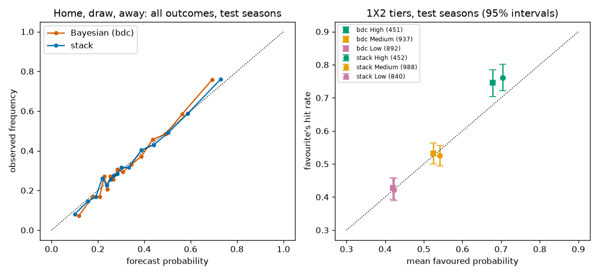

# Phase 4 backtest: challengers, stacking, calibration, tiers

Generated by `scripts/backtest_phase4.py` in 37 s.
Walk-forward predictions only. Tuning seasons 2021/22 and 2022/23 set every weight,
map, and cut point; test seasons 2023/24 to 2025/26 are scored once. Lower scores
are better. `slope`: observed home-win rate against forecast over five groups
(1 is honest; above 1 is too timid). `ece`: expected calibration error over all
three outcomes. Markets: `mkt_avg_pre` = market average at the Friday or Tuesday
snapshot, closest to our lock; `mkt_sharp` = Pinnacle closing (Betfair Exchange
closing after Pinnacle's data ends in Jan 2026). Odds are a benchmark, never an input.

## Acceptance checks (spec section 11, Phase 4)

| check | result |
|---|---|
| Full backtest against the closing market | Test log loss: stack 0.9738, Bayesian 0.9759, Friday market 0.9601, closing market 0.9571. Stack minus closing +0.0167 (interval +0.0106 to +0.0229). |
| Tier hit rates clearly separated | 1X2: Bayesian yes, stack yes. Over/under: 4 of 11 lines. |
| Leakage red flag (top pick above 60%) | Passed |

## 1. Leakage alarm (spec S8: top pick above 60%)

| model | tuning | test |
|---|---|---|
| base | 0.4566 | 0.4447 |
| elo | 0.5388 | 0.5237 |
| dc | 0.5316 | 0.5303 |
| bdc | 0.5362 | 0.5329 |
| multinomial | 0.5349 | 0.5342 |
| ordered_logit | 0.5322 | 0.5298 |
| random_forest | 0.5428 | 0.5338 |
| xgboost | 0.5441 | 0.5289 |
| stack | 0.5428 | 0.5338 |

**Passed: no forecast above 60%.**

## 2. Stack weights, fitted on the tuning seasons

Linear pool, each model at least 5%. Challengers: multinomial, ordered_logit, random_forest, xgboost.

| model | weight |
|---|---|
| elo | 0.0500 |
| dc | 0.0500 |
| bdc | 0.0500 |
| multinomial | 0.3448 |
| ordered_logit | 0.0500 |
| random_forest | 0.0500 |
| xgboost | 0.4052 |

### Are the weights stable? Fitted on each tuning season alone

| fitted_on | elo | dc | bdc | multinomial | ordered_logit | random_forest | xgboost |
|---|---|---|---|---|---|---|---|
| 2021/22 | 0.0605 | 0.0524 | 0.0788 | 0.2262 | 0.0507 | 0.4813 | 0.0502 |
| 2022/23 | 0.0500 | 0.0500 | 0.1571 | 0.0500 | 0.0500 | 0.0500 | 0.5929 |

### Cross-fitted log loss on the tuning seasons (weights from the other season)

| forecast | 2021/22 | 2022/23 |
|---|---|---|
| stack, cross-fitted | 0.9764 | 0.9877 |
| equal weights | 0.9751 | 0.9887 |
| bdc | 0.9792 | 0.9899 |
| multinomial | 0.9769 | 0.9896 |

## 3. Test seasons: home, draw, away against the market

| forecast | n | rps | log_loss | brier | top_pick | slope | ece |
|---|---|---|---|---|---|---|---|
| base | 2227 | 0.2289 | 1.0702 | 0.6472 | 0.4432 | 0.1438 | 0.0054 |
| elo | 2227 | 0.1982 | 0.9786 | 0.5829 | 0.5227 | 1.0000 | 0.0109 |
| dc | 2227 | 0.1974 | 0.9770 | 0.5811 | 0.5294 | 1.1986 | 0.0174 |
| bdc | 2227 | 0.1970 | 0.9759 | 0.5803 | 0.5312 | 1.2260 | 0.0143 |
| multinomial | 2227 | 0.1964 | 0.9739 | 0.5796 | 0.5326 | 1.0342 | 0.0060 |
| ordered_logit | 2227 | 0.1969 | 0.9746 | 0.5800 | 0.5290 | 1.0820 | 0.0065 |
| random_forest | 2227 | 0.1967 | 0.9752 | 0.5802 | 0.5326 | 1.0774 | 0.0069 |
| xgboost | 2227 | 0.1973 | 0.9775 | 0.5814 | 0.5276 | 1.0825 | 0.0116 |
| stack | 2227 | 0.1964 | 0.9738 | 0.5792 | 0.5321 | 1.0957 | 0.0092 |
| stack_weekly | 2227 | 0.1963 | 0.9732 | 0.5790 | 0.5326 | 1.0995 | 0.0069 |
| mkt_avg_pre | 2227 | 0.1922 | 0.9601 | 0.5705 | 0.5447 | 1.0850 | 0.0073 |
| mkt_sharp | 2227 | 0.1912 | 0.9571 | 0.5680 | 0.5492 | 1.0825 | 0.0046 |

### Paired differences, 95% bootstrap intervals (negative = first forecast better)

| comparison | metric | mean_diff | ci_low | ci_high |
|---|---|---|---|---|
| stack minus bdc | rps | -0.0006 | -0.0018 | 0.0006 |
| stack minus bdc | log_loss | -0.0022 | -0.0064 | 0.0019 |
| stack minus elo | rps | -0.0017 | -0.0031 | -0.0005 |
| stack minus elo | log_loss | -0.0049 | -0.0096 | -0.0005 |
| stack minus multinomial | rps | -0.0000 | -0.0007 | 0.0006 |
| stack minus multinomial | log_loss | -0.0001 | -0.0027 | 0.0025 |
| stack minus mkt_avg_pre | rps | 0.0042 | 0.0025 | 0.0059 |
| stack minus mkt_avg_pre | log_loss | 0.0137 | 0.0084 | 0.0192 |
| stack minus mkt_sharp | rps | 0.0052 | 0.0033 | 0.0072 |
| stack minus mkt_sharp | log_loss | 0.0167 | 0.0106 | 0.0229 |
| multinomial minus bdc | rps | -0.0005 | -0.0020 | 0.0009 |
| multinomial minus bdc | log_loss | -0.0021 | -0.0073 | 0.0032 |
| stack_weekly minus stack | rps | -0.0002 | -0.0004 | 0.0000 |
| stack_weekly minus stack | log_loss | -0.0006 | -0.0014 | 0.0003 |

Second look, added after the table above was seen, so it cannot choose anything
on its own: equal weights on all seven models.

| comparison | metric | mean_diff | ci_low | ci_high |
|---|---|---|---|---|
| equal weights minus bdc | rps | -0.0006 | -0.0016 | 0.0004 |
| equal weights minus bdc | log_loss | -0.0027 | -0.0061 | 0.0007 |

### By league

| league | forecast | rps | log_loss | brier | top_pick | slope | ece |
|---|---|---|---|---|---|---|---|
| EPL | elo | 0.2022 | 0.9865 | 0.5891 | 0.5233 | 0.9171 | 0.0227 |
| EPL | bdc | 0.1994 | 0.9781 | 0.5821 | 0.5295 | 1.1390 | 0.0145 |
| EPL | stack | 0.2002 | 0.9805 | 0.5844 | 0.5268 | 1.0131 | 0.0152 |
| EPL | mkt_avg_pre | 0.1959 | 0.9663 | 0.5752 | 0.5403 | 0.9750 | 0.0129 |
| EPL | mkt_sharp | 0.1941 | 0.9607 | 0.5708 | 0.5465 | 0.9809 | 0.0083 |
| LaLiga | elo | 0.1941 | 0.9707 | 0.5767 | 0.5221 | 1.0866 | 0.0127 |
| LaLiga | bdc | 0.1945 | 0.9738 | 0.5783 | 0.5329 | 1.3087 | 0.0191 |
| LaLiga | stack | 0.1926 | 0.9670 | 0.5740 | 0.5374 | 1.2259 | 0.0123 |
| LaLiga | mkt_avg_pre | 0.1886 | 0.9538 | 0.5657 | 0.5491 | 1.2435 | 0.0149 |
| LaLiga | mkt_sharp | 0.1882 | 0.9534 | 0.5653 | 0.5518 | 1.2182 | 0.0149 |

### Weekly re-weight replay (Phase 7 design)

`stack_weekly` starts from the tuning weights, then each Monday moves towards
weights refitted on every scored forecast so far: at most 10 points a week, 5%
floor, no move before 60 scored test matches.

| model | start | end_of_2025_26 | min | max |
|---|---|---|---|---|
| elo | 0.0500 | 0.0500 | 0.0500 | 0.1236 |
| dc | 0.0500 | 0.0500 | 0.0500 | 0.1000 |
| bdc | 0.0500 | 0.2068 | 0.0500 | 0.2068 |
| multinomial | 0.3448 | 0.4066 | 0.1626 | 0.4848 |
| ordered_logit | 0.0500 | 0.0500 | 0.0500 | 0.1000 |
| random_forest | 0.0500 | 0.1866 | 0.0500 | 0.4122 |
| xgboost | 0.4052 | 0.0500 | 0.0500 | 0.4052 |

## 4. Calibration of the stack, revisited

Method chosen on cross-fitted tuning forecasts (weights from the other season):
fit on 2021/22, validate on 2022/23.

| method | rps | log_loss | brier | top_pick | slope | ece |
|---|---|---|---|---|---|---|
| identity | 0.2057 | 0.9877 | 0.5882 | 0.5395 | 0.8893 | 0.0218 |
| power | 0.2059 | 0.9886 | 0.5886 | 0.5395 | 0.8313 | 0.0265 |
| dirichlet_0.001 | 0.2064 | 0.9932 | 0.5905 | 0.5355 | 0.8056 | 0.0310 |
| dirichlet_0.01 | 0.2060 | 0.9913 | 0.5897 | 0.5382 | 0.8152 | 0.0303 |
| dirichlet_0.1 | 0.2055 | 0.9886 | 0.5885 | 0.5382 | 0.8585 | 0.0262 |

Chosen: **identity**. Test seasons:

| forecast | rps | log_loss | brier | top_pick | slope | ece |
|---|---|---|---|---|---|---|
| stack, raw | 0.1962 | 0.9722 | 0.5781 | 0.5338 | 1.1106 | 0.0101 |
| stack, fixed map (identity) | 0.1962 | 0.9722 | 0.5781 | 0.5338 | 1.1106 | 0.0101 |
| stack, monthly power map | 0.1963 | 0.9730 | 0.5787 | 0.5338 | 1.0456 | 0.0104 |

| comparison | metric | mean_diff | ci_low | ci_high |
|---|---|---|---|---|
| fixed map (identity) minus raw | rps | 0.0000 | 0.0000 | 0.0000 |
| fixed map (identity) minus raw | log_loss | 0.0000 | 0.0000 | 0.0000 |
| monthly power map minus raw | rps | 0.0001 | -0.0003 | 0.0005 |
| monthly power map minus raw | log_loss | 0.0007 | -0.0008 | 0.0024 |

Strict rule (spec S5.6; decision of 25 Sep 2026): apply only if the whole 95%
interval of the log-loss change is below zero. Fixed map: **do not apply**. Monthly map: **no clear improvement**.

## 5. Goals markets kept coherent with the stack

Each Bayesian scoreline table is rescaled so its home-win, draw, and away-win
regions match the stack. Difference = rescaled
minus Bayesian.

| market | bdc_log_loss | rescaled_log_loss | diff | ci_low | ci_high |
|---|---|---|---|---|---|
| over 2.5 | 0.6730 | 0.6726 | -0.0005 | -0.0012 | 0.0003 |
| both teams score | 0.6855 | 0.6857 | 0.0002 | -0.0003 | 0.0007 |

Over/under 2.5 against the market (test seasons, matches with odds):

| forecast | n | log_loss | brier |
|---|---|---|---|
| base | 2220 | 0.6882 | 0.2475 |
| dc | 2220 | 0.6761 | 0.2415 |
| bdc | 2220 | 0.6731 | 0.2401 |
| bdc rescaled to stack | 2220 | 0.6727 | 0.2399 |
| mkt_avg_pre | 2220 | 0.6677 | 0.2375 |
| mkt_sharp | 2220 | 0.6647 | 0.2361 |

## 6. Confidence tiers: home, draw, away

Two candidate published forecasts: the Bayesian primary (`bdc`, live now) and the
stack. Each gets its own cut points from the tuning seasons:

| market | high | low | width_max | disagree_max | basis |
|---|---|---|---|---|---|
| 1x2 | 0.5800 | 0.4400 | 0.1600 | 0.0700 | bdc forecasts, 2021/22 and 2022/23 |
| 1x2_stack | 0.6000 | 0.4400 | 0.1600 | 0.0700 | stack forecasts, 2021/22 and 2022/23 (stack cross-fitted) |

`high` and `low`: top quarter and bottom third of tuning favoured probabilities.
`width_max` and `disagree_max`: widest or most disputed tenth of tuning forecasts;
above either drops one tier. Flags (source failure, unanswered question, manager
change) have no history and apply live only. The promoted-club flag is shown but
does not cap the tier (Lang, 26 Sep 2026; evidence below).

`gap` = hit rate minus mean favoured probability (0 is honest; above 0 means the
favourite won more often than promised). `excess_surprise` = log loss minus the
log loss the forecast expected of itself.

### Test seasons

| market | tier | n | share | mean_favoured | hit_rate | hit_ci_low | hit_ci_high | gap | gap_ci_low | gap_ci_high | log_loss | excess_surprise |
|---|---|---|---|---|---|---|---|---|---|---|---|---|
| 1X2 bdc | High | 451 | 0.1978 | 0.6782 | 0.7450 | 0.7029 | 0.7849 | 0.0668 | 0.0267 | 0.1058 | 0.7301 | -0.1026 |
| 1X2 bdc | Medium | 937 | 0.4110 | 0.5251 | 0.5315 | 0.4995 | 0.5635 | 0.0064 | -0.0250 | 0.0388 | 0.9988 | -0.0112 |
| 1X2 bdc | Low | 892 | 0.3912 | 0.4201 | 0.4271 | 0.3935 | 0.4585 | 0.0070 | -0.0269 | 0.0389 | 1.0727 | -0.0005 |
| 1X2 stack | High | 452 | 0.1982 | 0.7036 | 0.7611 | 0.7212 | 0.8009 | 0.0574 | 0.0175 | 0.0963 | 0.7042 | -0.0898 |
| 1X2 stack | Medium | 988 | 0.4333 | 0.5416 | 0.5253 | 0.4939 | 0.5557 | -0.0163 | -0.0473 | 0.0142 | 1.0050 | 0.0152 |
| 1X2 stack | Low | 840 | 0.3684 | 0.4225 | 0.4214 | 0.3881 | 0.4560 | -0.0010 | -0.0343 | 0.0345 | 1.0779 | 0.0054 |

Hit rates clearly separated on the test seasons (adjacent 95% intervals do not
overlap): bdc **yes**, stack **yes**.

### Tuning seasons

| market | tier | n | share | mean_favoured | hit_rate | hit_ci_low | hit_ci_high | gap | gap_ci_low | gap_ci_high | log_loss | excess_surprise |
|---|---|---|---|---|---|---|---|---|---|---|---|---|
| 1X2 bdc | High | 305 | 0.2007 | 0.6796 | 0.7443 | 0.6984 | 0.7934 | 0.0647 | 0.0170 | 0.1117 | 0.7509 | -0.0790 |
| 1X2 bdc | Medium | 551 | 0.3625 | 0.5209 | 0.5281 | 0.4864 | 0.5717 | 0.0072 | -0.0350 | 0.0504 | 1.0099 | -0.0041 |
| 1X2 bdc | Low | 664 | 0.4368 | 0.4177 | 0.4473 | 0.4111 | 0.4849 | 0.0296 | -0.0067 | 0.0671 | 1.0708 | -0.0040 |
| 1X2 stack | High | 285 | 0.1875 | 0.7074 | 0.7228 | 0.6702 | 0.7754 | 0.0154 | -0.0365 | 0.0667 | 0.7719 | -0.0190 |
| 1X2 stack | Medium | 631 | 0.4151 | 0.5356 | 0.5452 | 0.5055 | 0.5832 | 0.0095 | -0.0301 | 0.0474 | 0.9975 | 0.0012 |
| 1X2 stack | Low | 604 | 0.3974 | 0.4210 | 0.4520 | 0.4123 | 0.4934 | 0.0310 | -0.0082 | 0.0719 | 1.0651 | -0.0083 |

### Do the uncertainty inputs and flags pick out worse-than-promised forecasts?

The real test of a tier input (PRD item 13). `gap` = excess surprise of the
flagged forecasts minus the rest; above 0 means the input finds forecasts that do
worse than promised.

| input | stage | n_flagged | excess_flagged | excess_rest | gap | ci_low | ci_high |
|---|---|---|---|---|---|---|---|
| bdc: wide interval | tuning | 128 | -0.0096 | -0.0200 | 0.0104 | -0.0571 | 0.0810 |
| bdc: stack and Bayesian disagree | tuning | 166 | -0.0272 | -0.0181 | -0.0091 | -0.0735 | 0.0577 |
| bdc: promoted club, under 6 games | tuning | 67 | -0.0570 | -0.0173 | -0.0397 | -0.1211 | 0.0439 |
| bdc: wide interval | test | 194 | 0.0063 | -0.0280 | 0.0344 | -0.0238 | 0.0940 |
| bdc: stack and Bayesian disagree | test | 262 | -0.0100 | -0.0271 | 0.0171 | -0.0371 | 0.0721 |
| bdc: promoted club, under 6 games | test | 101 | -0.1052 | -0.0214 | -0.0838 | -0.1539 | -0.0098 |
| stack: wide interval | tuning | 127 | -0.0046 | -0.0066 | 0.0019 | -0.0665 | 0.0798 |
| stack: stack and Bayesian disagree | tuning | 166 | 0.0231 | -0.0100 | 0.0331 | -0.0506 | 0.1203 |
| stack: promoted club, under 6 games | tuning | 67 | -0.0468 | -0.0045 | -0.0422 | -0.1270 | 0.0485 |
| stack: wide interval | test | 190 | 0.0159 | -0.0115 | 0.0274 | -0.0351 | 0.0943 |
| stack: stack and Bayesian disagree | test | 262 | 0.0640 | -0.0187 | 0.0827 | 0.0124 | 0.1542 |
| stack: promoted club, under 6 games | test | 101 | -0.1048 | -0.0048 | -0.1000 | -0.1738 | -0.0252 |

## 7. Confidence tiers: over/under lines

Favoured probability = the likelier side of the line. Cut points per line from
the tuning seasons, same quantiles as above. Goals also use the 80% interval
width. Cards count an unknown referee as a flag (all La Liga matches, most EPL
Friday and Saturday matches), which caps them at Medium.

### Hit rates clearly separated on the test seasons?

| market | separated_on_test |
|---|---|
| goals over 1.5 | True |
| goals over 2.5 | False |
| goals over 3.5 | True |
| both teams score | False |
| corners over 8.5 | True |
| corners over 9.5 | False |
| corners over 10.5 | False |
| corners over 11.5 | False |
| cards over 3.5 | False |
| cards over 4.5 | False |
| cards over 5.5 | True |

### Test seasons

| market | tier | n | share | mean_favoured | hit_rate | hit_ci_low | hit_ci_high | gap | gap_ci_low | gap_ci_high | log_loss | excess_surprise |
|---|---|---|---|---|---|---|---|---|---|---|---|---|
| goals over 1.5 | High | 781 | 0.3425 | 0.8287 | 0.8528 | 0.8284 | 0.8758 | 0.0241 | -0.0006 | 0.0472 | 0.4147 | -0.0406 |
| goals over 1.5 | Medium | 845 | 0.3706 | 0.7518 | 0.7763 | 0.7503 | 0.8024 | 0.0245 | -0.0018 | 0.0511 | 0.5317 | -0.0268 |
| goals over 1.5 | Low | 654 | 0.2868 | 0.6563 | 0.7003 | 0.6651 | 0.7355 | 0.0440 | 0.0093 | 0.0784 | 0.6083 | -0.0303 |
| goals over 2.5 | High | 653 | 0.2864 | 0.6540 | 0.6371 | 0.6003 | 0.6738 | -0.0169 | -0.0535 | 0.0194 | 0.6532 | 0.0108 |
| goals over 2.5 | Medium | 766 | 0.3360 | 0.5858 | 0.5888 | 0.5548 | 0.6240 | 0.0029 | -0.0308 | 0.0374 | 0.6732 | -0.0036 |
| goals over 2.5 | Low | 861 | 0.3776 | 0.5297 | 0.5389 | 0.5052 | 0.5738 | 0.0092 | -0.0235 | 0.0437 | 0.6880 | -0.0025 |
| goals over 3.5 | High | 409 | 0.1794 | 0.8278 | 0.8117 | 0.7751 | 0.8509 | -0.0161 | -0.0532 | 0.0215 | 0.4839 | 0.0268 |
| goals over 3.5 | Medium | 769 | 0.3373 | 0.7388 | 0.7334 | 0.7022 | 0.7659 | -0.0053 | -0.0362 | 0.0272 | 0.5795 | 0.0074 |
| goals over 3.5 | Low | 1102 | 0.4833 | 0.6236 | 0.6270 | 0.5989 | 0.6570 | 0.0035 | -0.0245 | 0.0328 | 0.6572 | 0.0009 |
| both teams score | High | 679 | 0.2978 | 0.6121 | 0.6156 | 0.5788 | 0.6524 | 0.0035 | -0.0327 | 0.0408 | 0.6655 | -0.0010 |
| both teams score | Medium | 879 | 0.3855 | 0.5569 | 0.5279 | 0.4960 | 0.5597 | -0.0291 | -0.0613 | 0.0027 | 0.6942 | 0.0082 |
| both teams score | Low | 722 | 0.3167 | 0.5189 | 0.5069 | 0.4681 | 0.5443 | -0.0120 | -0.0499 | 0.0247 | 0.6936 | 0.0016 |
| corners over 8.5 | High | 654 | 0.2868 | 0.7355 | 0.7309 | 0.6942 | 0.7646 | -0.0046 | -0.0411 | 0.0298 | 0.5826 | 0.0070 |
| corners over 8.5 | Medium | 1113 | 0.4882 | 0.6511 | 0.6505 | 0.6217 | 0.6783 | -0.0006 | -0.0290 | 0.0273 | 0.6436 | -0.0009 |
| corners over 8.5 | Low | 513 | 0.2250 | 0.5553 | 0.5458 | 0.4990 | 0.5887 | -0.0095 | -0.0553 | 0.0338 | 0.6869 | 0.0010 |
| corners over 9.5 | High | 541 | 0.2373 | 0.6340 | 0.6229 | 0.5823 | 0.6636 | -0.0111 | -0.0524 | 0.0290 | 0.6628 | 0.0080 |
| corners over 9.5 | Medium | 711 | 0.3118 | 0.5786 | 0.5865 | 0.5513 | 0.6217 | 0.0079 | -0.0274 | 0.0430 | 0.6777 | -0.0028 |
| corners over 9.5 | Low | 1028 | 0.4509 | 0.5312 | 0.5467 | 0.5175 | 0.5759 | 0.0155 | -0.0138 | 0.0449 | 0.6880 | -0.0026 |
| corners over 10.5 | High | 343 | 0.1504 | 0.7061 | 0.6735 | 0.6239 | 0.7230 | -0.0326 | -0.0820 | 0.0155 | 0.6335 | 0.0288 |
| corners over 10.5 | Medium | 1132 | 0.4965 | 0.6161 | 0.6148 | 0.5866 | 0.6431 | -0.0013 | -0.0298 | 0.0276 | 0.6630 | -0.0002 |
| corners over 10.5 | Low | 805 | 0.3531 | 0.5304 | 0.5130 | 0.4783 | 0.5478 | -0.0173 | -0.0521 | 0.0183 | 0.6926 | 0.0020 |
| corners over 11.5 | High | 350 | 0.1535 | 0.8016 | 0.7743 | 0.7314 | 0.8171 | -0.0273 | -0.0714 | 0.0154 | 0.5353 | 0.0379 |
| corners over 11.5 | Medium | 1118 | 0.4904 | 0.7235 | 0.7281 | 0.7012 | 0.7558 | 0.0046 | -0.0229 | 0.0321 | 0.5824 | -0.0045 |
| corners over 11.5 | Low | 812 | 0.3561 | 0.6251 | 0.6121 | 0.5764 | 0.6466 | -0.0130 | -0.0482 | 0.0200 | 0.6608 | 0.0022 |
| cards over 3.5 | High | 9 | 0.0039 | 0.7458 | 0.7778 | 0.4444 | 1.0000 | 0.0320 | -0.2819 | 0.2562 | 0.5114 | -0.0534 |
| cards over 3.5 | Medium | 1195 | 0.5241 | 0.6745 | 0.6820 | 0.6544 | 0.7096 | 0.0075 | -0.0198 | 0.0347 | 0.6197 | -0.0046 |
| cards over 3.5 | Low | 1076 | 0.4719 | 0.5473 | 0.5204 | 0.4916 | 0.5502 | -0.0268 | -0.0557 | 0.0027 | 0.6920 | 0.0049 |
| cards over 4.5 | High | 16 | 0.0070 | 0.8013 | 0.8125 | 0.5625 | 1.0000 | 0.0112 | -0.2166 | 0.1877 | 0.4538 | -0.0408 |
| cards over 4.5 | Medium | 1081 | 0.4741 | 0.6688 | 0.6503 | 0.6226 | 0.6799 | -0.0185 | -0.0460 | 0.0108 | 0.6481 | 0.0190 |
| cards over 4.5 | Low | 1183 | 0.5189 | 0.5471 | 0.5503 | 0.5216 | 0.5782 | 0.0032 | -0.0258 | 0.0312 | 0.6851 | -0.0021 |
| cards over 5.5 | High | 18 | 0.0079 | 0.8969 | 0.9444 | 0.8333 | 1.0000 | 0.0475 | -0.0695 | 0.1099 | 0.2258 | -0.1031 |
| cards over 5.5 | Medium | 1541 | 0.6759 | 0.7721 | 0.7696 | 0.7482 | 0.7898 | -0.0024 | -0.0231 | 0.0177 | 0.5354 | 0.0076 |
| cards over 5.5 | Low | 721 | 0.3162 | 0.6160 | 0.6546 | 0.6200 | 0.6907 | 0.0387 | 0.0048 | 0.0743 | 0.6399 | -0.0215 |

### Do the flags pick out worse-than-promised forecasts? Test seasons

Unknown referee is checked in the EPL only (La Liga never has one at lock).

| input | stage | n_flagged | excess_flagged | excess_rest | gap | ci_low | ci_high |
|---|---|---|---|---|---|---|---|
| goals over 1.5: promoted club, under 6 games | test | 101 | -0.0134 | -0.0334 | 0.0200 | -0.0589 | 0.1071 |
| goals over 2.5: promoted club, under 6 games | test | 101 | -0.0414 | 0.0029 | -0.0443 | -0.0787 | -0.0077 |
| goals over 3.5: promoted club, under 6 games | test | 101 | 0.0033 | 0.0079 | -0.0046 | -0.0808 | 0.0755 |
| both teams score: promoted club, under 6 games | test | 101 | 0.0065 | 0.0032 | 0.0033 | -0.0225 | 0.0277 |
| corners over 8.5: promoted club, under 6 games | test | 101 | -0.0057 | 0.0022 | -0.0079 | -0.0706 | 0.0604 |
| corners over 9.5: promoted club, under 6 games | test | 101 | -0.0239 | 0.0010 | -0.0249 | -0.0565 | 0.0065 |
| corners over 10.5: promoted club, under 6 games | test | 101 | -0.0067 | 0.0055 | -0.0122 | -0.0550 | 0.0290 |
| corners over 11.5: promoted club, under 6 games | test | 101 | -0.0452 | 0.0067 | -0.0519 | -0.1221 | 0.0216 |
| cards over 3.5: promoted club, under 6 games | test | 101 | 0.0219 | -0.0014 | 0.0233 | -0.0309 | 0.0783 |
| cards over 3.5: EPL referee unknown | test | 716 | 0.0117 | -0.0181 | 0.0298 | 0.0094 | 0.0493 |
| cards over 4.5: promoted club, under 6 games | test | 101 | 0.0039 | 0.0078 | -0.0040 | -0.0613 | 0.0564 |
| cards over 4.5: EPL referee unknown | test | 716 | 0.0246 | 0.0232 | 0.0014 | -0.0388 | 0.0397 |
| cards over 5.5: promoted club, under 6 games | test | 101 | -0.0037 | -0.0024 | -0.0013 | -0.0853 | 0.0943 |
| cards over 5.5: EPL referee unknown | test | 716 | 0.0237 | -0.0110 | 0.0347 | -0.0285 | 0.0969 |

### Tuning seasons

| market | tier | n | share | mean_favoured | hit_rate | hit_ci_low | hit_ci_high | gap | gap_ci_low | gap_ci_high | log_loss | excess_surprise |
|---|---|---|---|---|---|---|---|---|---|---|---|---|
| goals over 1.5 | High | 359 | 0.2362 | 0.8242 | 0.7883 | 0.7437 | 0.8301 | -0.0359 | -0.0789 | 0.0046 | 0.5185 | 0.0562 |
| goals over 1.5 | Medium | 603 | 0.3967 | 0.7458 | 0.7363 | 0.6998 | 0.7711 | -0.0095 | -0.0461 | 0.0248 | 0.5748 | 0.0097 |
| goals over 1.5 | Low | 558 | 0.3671 | 0.6583 | 0.6900 | 0.6505 | 0.7294 | 0.0316 | -0.0073 | 0.0714 | 0.6217 | -0.0157 |
| goals over 2.5 | High | 391 | 0.2572 | 0.6513 | 0.6394 | 0.5908 | 0.6854 | -0.0119 | -0.0605 | 0.0342 | 0.6502 | 0.0064 |
| goals over 2.5 | Medium | 522 | 0.3434 | 0.5813 | 0.5613 | 0.5172 | 0.6015 | -0.0200 | -0.0631 | 0.0205 | 0.6883 | 0.0098 |
| goals over 2.5 | Low | 607 | 0.3993 | 0.5303 | 0.5173 | 0.4778 | 0.5552 | -0.0130 | -0.0527 | 0.0253 | 0.6906 | 0.0003 |
| goals over 3.5 | High | 359 | 0.2362 | 0.8265 | 0.8162 | 0.7744 | 0.8552 | -0.0104 | -0.0524 | 0.0297 | 0.4833 | 0.0246 |
| goals over 3.5 | Medium | 616 | 0.4053 | 0.7429 | 0.7500 | 0.7143 | 0.7825 | 0.0071 | -0.0290 | 0.0400 | 0.5623 | -0.0055 |
| goals over 3.5 | Low | 545 | 0.3586 | 0.6354 | 0.6183 | 0.5798 | 0.6588 | -0.0171 | -0.0574 | 0.0235 | 0.6633 | 0.0132 |
| both teams score | High | 343 | 0.2257 | 0.6084 | 0.5831 | 0.5306 | 0.6327 | -0.0253 | -0.0778 | 0.0252 | 0.6828 | 0.0145 |
| both teams score | Medium | 622 | 0.4092 | 0.5546 | 0.5450 | 0.5064 | 0.5836 | -0.0096 | -0.0489 | 0.0289 | 0.6893 | 0.0027 |
| both teams score | Low | 555 | 0.3651 | 0.5186 | 0.4919 | 0.4486 | 0.5315 | -0.0267 | -0.0702 | 0.0133 | 0.6955 | 0.0034 |
| corners over 8.5 | High | 374 | 0.2461 | 0.7261 | 0.7005 | 0.6578 | 0.7487 | -0.0256 | -0.0678 | 0.0237 | 0.6129 | 0.0270 |
| corners over 8.5 | Medium | 613 | 0.4033 | 0.6545 | 0.6362 | 0.5987 | 0.6737 | -0.0182 | -0.0548 | 0.0186 | 0.6538 | 0.0117 |
| corners over 8.5 | Low | 533 | 0.3507 | 0.5498 | 0.5741 | 0.5310 | 0.6173 | 0.0243 | -0.0185 | 0.0662 | 0.6777 | -0.0093 |
| corners over 9.5 | High | 352 | 0.2316 | 0.6242 | 0.5966 | 0.5455 | 0.6450 | -0.0276 | -0.0797 | 0.0225 | 0.6782 | 0.0172 |
| corners over 9.5 | Medium | 586 | 0.3855 | 0.5794 | 0.5427 | 0.5017 | 0.5819 | -0.0367 | -0.0782 | 0.0024 | 0.6911 | 0.0109 |
| corners over 9.5 | Low | 582 | 0.3829 | 0.5347 | 0.5137 | 0.4725 | 0.5533 | -0.0210 | -0.0628 | 0.0192 | 0.6929 | 0.0028 |
| corners over 10.5 | High | 390 | 0.2566 | 0.7110 | 0.6872 | 0.6410 | 0.7333 | -0.0238 | -0.0689 | 0.0216 | 0.6215 | 0.0213 |
| corners over 10.5 | Medium | 626 | 0.4118 | 0.6206 | 0.5831 | 0.5431 | 0.6214 | -0.0376 | -0.0775 | 0.0007 | 0.6825 | 0.0220 |
| corners over 10.5 | Low | 504 | 0.3316 | 0.5322 | 0.5536 | 0.5079 | 0.5972 | 0.0213 | -0.0239 | 0.0646 | 0.6874 | -0.0031 |
| corners over 11.5 | High | 394 | 0.2592 | 0.8058 | 0.8020 | 0.7614 | 0.8401 | -0.0038 | -0.0443 | 0.0349 | 0.4958 | 0.0045 |
| corners over 11.5 | Medium | 657 | 0.4322 | 0.7253 | 0.7062 | 0.6697 | 0.7397 | -0.0191 | -0.0554 | 0.0154 | 0.6066 | 0.0220 |
| corners over 11.5 | Low | 469 | 0.3086 | 0.6365 | 0.6354 | 0.5906 | 0.6759 | -0.0011 | -0.0449 | 0.0394 | 0.6526 | -0.0011 |
| cards over 3.5 | High | 20 | 0.0132 | 0.7317 | 0.6000 | 0.3500 | 0.8000 | -0.1317 | -0.3758 | 0.0744 | 0.7336 | 0.1536 |
| cards over 3.5 | Medium | 966 | 0.6355 | 0.6953 | 0.6967 | 0.6667 | 0.7257 | 0.0014 | -0.0278 | 0.0299 | 0.5978 | -0.0059 |
| cards over 3.5 | Low | 534 | 0.3513 | 0.5499 | 0.5262 | 0.4831 | 0.5693 | -0.0237 | -0.0657 | 0.0199 | 0.6927 | 0.0061 |
| cards over 4.5 | High | 126 | 0.0829 | 0.8109 | 0.7778 | 0.7063 | 0.8492 | -0.0331 | -0.1051 | 0.0361 | 0.5337 | 0.0526 |
| cards over 4.5 | Medium | 880 | 0.5789 | 0.7206 | 0.6875 | 0.6568 | 0.7182 | -0.0331 | -0.0622 | -0.0026 | 0.6151 | 0.0353 |
| cards over 4.5 | Low | 514 | 0.3382 | 0.5451 | 0.5292 | 0.4844 | 0.5720 | -0.0159 | -0.0599 | 0.0277 | 0.6854 | -0.0021 |
| cards over 5.5 | High | 133 | 0.0875 | 0.9045 | 0.8947 | 0.8346 | 0.9398 | -0.0097 | -0.0663 | 0.0378 | 0.3351 | 0.0229 |
| cards over 5.5 | Medium | 872 | 0.5737 | 0.8240 | 0.7901 | 0.7638 | 0.8177 | -0.0338 | -0.0608 | -0.0067 | 0.4988 | 0.0511 |
| cards over 5.5 | Low | 515 | 0.3388 | 0.5972 | 0.5689 | 0.5262 | 0.6117 | -0.0283 | -0.0699 | 0.0151 | 0.6778 | 0.0091 |
